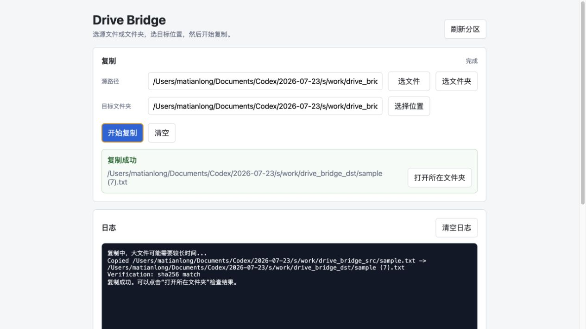

# Drive Bridge

Drive Bridge 是一个在 macOS 和 Windows 上使用的本地文件迁移工具，用来在 APFS、exFAT、NTFS 等已挂载分区之间复制文件或文件夹，并在复制后校验内容一致。


## 这个工具解决什么问题

很多移动硬盘会同时给 macOS 和 Windows 使用。常见分区格式包括：

- APFS：macOS 原生格式。
- exFAT：macOS 和 Windows 都比较容易读写，适合作为跨平台中间分区。
- NTFS：Windows 原生格式，macOS 通常只能读，不能直接写。

重要说明：视频、图片、文档这些文件本身不需要“转换成 APFS 或 NTFS 格式”。真正需要做的是把同一份文件安全复制到另一个文件系统的分区里，并确认复制后没有损坏。

Drive Bridge 做的事情：

- 选择一个源文件或文件夹。
- 选择复制到的目标文件夹。
- 自动检查空间和写入权限。
- 自动处理同名文件，默认改名保留两份。
- 复制后使用 SHA-256 校验。
- 复制成功后提供“打开所在文件夹”按钮。



## 快速使用

### macOS

双击启动：

```text
drive-bridge-mac.command
```

双击关闭：

```text
drive-bridge-stop-mac.command
```

也可以双击：

```text
Drive Bridge.app
```

`.app` 会打开 Terminal 启动本地服务，这是为了避开 macOS 从 Finder 直接启动 Python 时可能遇到的 Documents 目录权限限制。

### Windows

双击启动：

```text
drive-bridge-win.bat
```

双击关闭：

```text
drive-bridge-stop-win.bat
```

Windows 版本会打开本地网页界面。点击“选文件”“选文件夹”“选择位置”时，会弹出 Windows 原生选择窗口。

## 操作教程

1. 启动 Drive Bridge。
2. 点击“选文件”或“选文件夹”，选择要复制的资源。
3. 点击“选择位置”，选择复制到的目标文件夹。
4. 点击“开始复制”。
5. 在“日志”里查看复制过程和校验结果。
6. 复制成功后，点击“打开所在文件夹”检查复制出来的文件。

默认行为：

- 重名文件自动改名，例如 `video.mp4` 已存在时，会复制成 `video (1).mp4`。
- 默认使用 SHA-256 校验复制结果。
- 不会删除源文件。
- 不会格式化硬盘。
- 不会修改分区表。

## 命令行用法

列出分区：

```bash
python3 drive_bridge.py list
```

复制文件：

```bash
python3 drive_bridge.py copy "/Volumes/EXFAT_DISK/video.mp4" "$HOME/Movies" --into
```

复制文件夹：

```bash
python3 drive_bridge.py copy "/Volumes/EXFAT_DISK/Project" "$HOME/Documents" --into
```

校验两份已有文件：

```bash
python3 drive_bridge.py verify "/Volumes/EXFAT_DISK/video.mp4" "$HOME/Movies/video.mp4"
```

启动网页界面：

```bash
python3 drive_bridge_gui.py
```

关闭网页界面：

```bash
python3 drive_bridge_gui.py --stop
```

## 下载包

项目发布时会提供两个可解压使用的包：

- `DriveBridge-macOS.zip`
- `DriveBridge-Windows.zip`

下载后解压，按对应系统双击启动脚本即可。

## 后台日志

macOS：

```text
$TMPDIR/drive-bridge/drive-bridge.log
```

Windows：

```text
%LOCALAPPDATA%\DriveBridge\drive-bridge.log
```

## 实现原理

详细实现说明见：

```text
docs/ARCHITECTURE.md
```

简要来说，Drive Bridge 启动的是一个只监听 `127.0.0.1` 的本机网页服务。浏览器只是界面，实际复制、校验、打开文件夹都由本机 Python 进程完成，文件不会上传到外网。

## 开发博客

开发初衷、底层原理和技术选型见：

```text
docs/blog/drive-bridge-story.md
```

## 开源许可

MIT License
